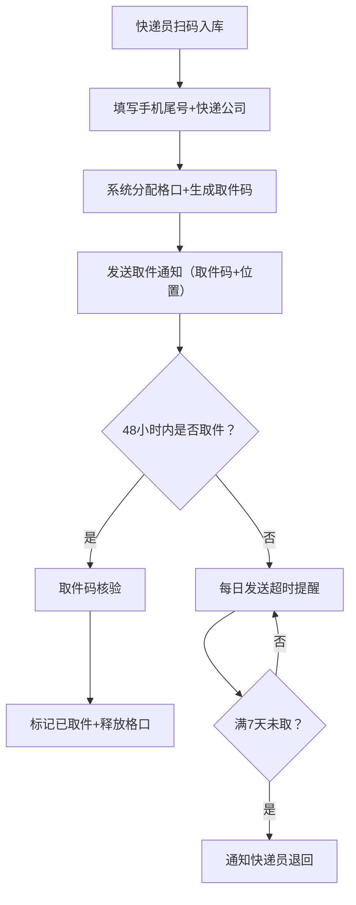

## 1. 产品概述

小区快递代收与取件通知系统，解决小区末端快递配送效率低、通知不及时、取件不便等问题。面向小区居民、快递员、驿站管理员三类用户，提供快递入库、取件通知、取件核验、超时提醒、预约寄存、数据统计等全流程服务。

- 目标用户：小区居民、合作快递公司的快递员、驿站管理员
- 核心价值：提升快递末端配送效率、降低错取漏取率、优化驿站运营管理

## 2. 核心功能

### 2.1 用户角色

| 角色 | 注册方式 | 核心权限 |
|------|----------|----------|
| 居民 | 手机号注册 | 查询个人包裹、取件、预约大件存放、查看取件记录 |
| 快递员 | 管理员审核注册 | 扫码/批量入库、查看本人入库记录、处理退回通知 |
| 管理员 | 系统预设 | 全局数据统计、用户管理、格口管理、退回处理、系统配置 |

### 2.2 功能模块

1. **登录注册页**：角色选择、手机号登录、权限验证
2. **快递入库模块**：扫码入库、批量导入运单、自动分配格口、生成取件码
3. **取件通知模块**：短信/站内通知、超时48小时每日提醒、7天退回通知
4. **取件核验模块**：取件码核验、扫码取件、释放格口
5. **包裹查询模块**：居民查个人包裹、快递员查本公司包裹、管理员全局查询
6. **预约寄存模块**：大件存放预约、预约审核、到时提醒
7. **数据统计模块**：入库量统计、取件率分析、积压包裹监控
8. **系统管理模块**：用户管理、格口管理、快递公司配置、通知模板配置

### 2.3 页面详情

| 页面名称 | 模块名称 | 功能描述 |
|---------|----------|---------|
| 登录页 | 身份认证 | 角色切换、手机号+验证码登录、权限路由 |
| 居民首页 | 个人包裹中心 | 待取件列表、历史记录、取件码展示、预约入口 |
| 快递员首页 | 入库工作台 | 扫码入库表单、批量导入、入库记录、退回处理 |
| 管理员首页 | 数据看板 | 今日入库量、取件率、积压数、趋势图表 |
| 包裹管理页 | 包裹列表 | 多条件筛选、状态追踪、操作日志、批量处理 |
| 预约管理页 | 寄存预约 | 预约申请、审核、状态更新、超时提醒 |
| 格口管理页 | 格口配置 | 格口增删改、状态监控、格口使用率 |
| 用户管理页 | 权限管理 | 用户增删改、角色分配、快递公司绑定 |
| 统计报表页 | 数据分析 | 时段统计、取件率分析、快递公司对比、导出 |

## 3. 核心流程

### 3.1 快递入库流程
快递员登录 → 扫描运单号/输入手机号尾号 → 选择快递公司 → 系统自动分配格口 → 生成6位取件码 → 发送取件通知 → 入库完成

### 3.2 取件流程
收件人到达驿站 → 报取件码/扫码 → 系统核验取件码有效性 → 显示存放位置 → 管理员确认取出 → 标记已取件 → 释放格口

### 3.3 超时处理流程
包裹入库 → 48小时未取 → 每日发送一次提醒 → 满7天未取 → 自动通知对应快递员 → 快递员确认退回 → 标记退回状态

### 3.4 预约寄存流程
居民提交预约 → 填写物品信息/预计送达时间 → 管理员审核 → 分配格口 → 快递送达入库 → 通知居民取件

## 4. 用户界面设计

### 4.1 设计风格
- **主色调**：专业蓝 `#1E40AF`，代表可靠与信任
- **辅助色**：成功绿 `#059669`、警告橙 `#D97706`、危险红 `#DC2626`
- **中性色**：深灰 `#1F2937`、中灰 `#6B7280`、浅灰 `#F3F4F6`、白色 `#FFFFFF`
- **按钮风格**：圆角8px、带微妙阴影、hover时上浮2px+阴影加深
- **字体**：展示字体使用「思源黑体 Bold」，正文字体使用「思源黑体 Regular」
- **布局风格**：卡片式布局、顶部导航+侧边栏、清晰的视觉层级
- **图标**：使用Lucide图标库，风格统一线性图标

### 4.2 页面设计概述

| 页面名称 | 模块名称 | UI元素 |
|---------|----------|--------|
| 登录页 | 身份认证 | 渐变背景、卡片式登录框、角色切换标签页、动态验证码按钮、登录按钮微动画 |
| 居民首页 | 包裹中心 | 顶部问候语、待取件数量徽章、包裹卡片（取件码醒目、格口位置、快递公司标识）、历史记录列表、预约按钮 |
| 快递员首页 | 入库工作台 | 扫码输入框（相机图标）、快速入库表单、批量导入按钮、入库记录表格、待处理退回提醒 |
| 管理员首页 | 数据看板 | 大数字统计卡片（带动画计数）、折线趋势图、饼状取件率、积压包裹预警列表、快捷操作区 |
| 包裹管理页 | 包裹列表 | 高级筛选栏、状态标签、数据表格、操作列按钮、批量操作工具栏、详情抽屉 |
| 统计报表页 | 数据分析 | 日期范围选择器、多维度图表、数据表格、导出按钮、图表切换 |

### 4.3 响应式设计
- 采用桌面优先设计，适配1920px、1440px、1024px主流分辨率
- 侧边栏在平板端可折叠，移动端转为底部Tab导航
- 表格在小屏幕转为卡片列表展示
- 所有可点击区域不小于44x44px，适配触摸操作

### 4.4 动画与交互
- 页面加载：元素淡入+上移，采用staggered延迟动画
- 取件码显示：点击复制时的成功反馈动画
- 数据更新：数字变化时的滚动计数动画
- 状态变更：包裹状态标签的颜色过渡动画
- 表单提交：按钮loading状态、成功/失败的toast通知
