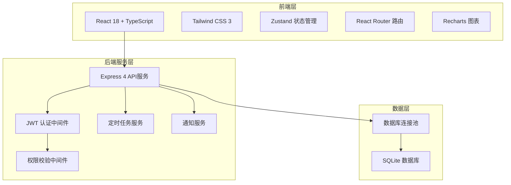
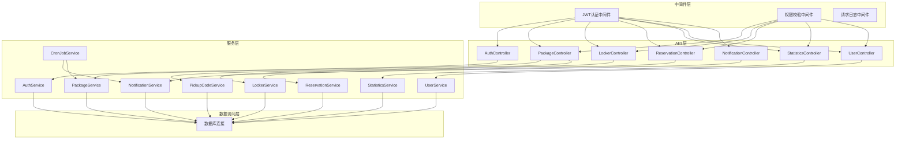
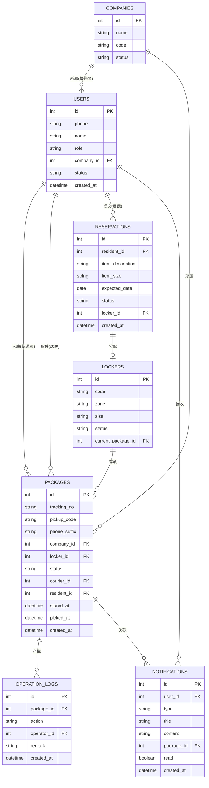

## 1. 架构设计



## 2. 技术选型说明

- **前端框架**：React 18 + TypeScript + Vite
  - 选择理由：组件化开发、类型安全、开发体验好、社区生态成熟
- **前端路由**：React Router DOM v6
  - 选择理由：React官方推荐路由库，支持嵌套路由、动态路由
- **状态管理**：Zustand
  - 选择理由：轻量、简洁、支持Typescript、无Provider包裹
- **UI样式**：Tailwind CSS 3
  - 选择理由：原子化CSS、开发效率高、易于维护一致的设计系统
- **图表库**：Recharts
  - 选择理由：React原生图表库、开箱即用、支持多种图表类型
- **图标库**：Lucide React
  - 选择理由：轻量、风格统一、支持Tree-shaking
- **后端框架**：Express 4 + TypeScript
  - 选择理由：轻量灵活、中间件生态丰富、适合中小型应用
- **数据库**：SQLite
  - 选择理由：零配置、文件型数据库、适合小型系统、易于部署
- **认证方式**：JWT Token
  - 选择理由：无状态、跨域支持、移动端友好
- **定时任务**：node-cron
  - 选择理由：类cron语法、支持多种时间配置

## 3. 路由定义

### 3.1 前端路由

| 路由路径 | 页面名称 | 权限角色 | 说明 |
|---------|---------|---------|------|
| `/login` | 登录页 | 公开 | 角色切换、手机号登录 |
| `/resident` | 居民首页 | 居民 | 个人包裹列表、取件码 |
| `/resident/history` | 取件历史 | 居民 | 历史取件记录 |
| `/resident/reservation` | 预约寄存 | 居民 | 大件存放预约申请 |
| `/courier` | 快递员首页 | 快递员 | 入库工作台、扫码入库 |
| `/courier/batch` | 批量入库 | 快递员 | 导入运单、批量入库 |
| `/courier/records` | 入库记录 | 快递员 | 本人入库记录查询 |
| `/courier/return` | 退回处理 | 快递员 | 超时退回包裹处理 |
| `/admin` | 管理员首页 | 管理员 | 数据看板、统计概览 |
| `/admin/packages` | 包裹管理 | 管理员 | 全局包裹查询、处理 |
| `/admin/pickup` | 取件核验 | 管理员 | 取件码核验、出库操作 |
| `/admin/lockers` | 格口管理 | 管理员 | 格口配置、状态监控 |
| `/admin/users` | 用户管理 | 管理员 | 用户增删改、权限配置 |
| `/admin/reservations` | 预约管理 | 管理员 | 预约审核、处理 |
| `/admin/statistics` | 统计报表 | 管理员 | 多维度数据分析、导出 |

### 3.2 后端API路由

| 方法 | 路径 | 模块 | 权限 | 说明 |
|-----|------|------|------|------|
| POST | `/api/auth/login` | 认证 | 公开 | 用户登录，返回token |
| POST | `/api/auth/register` | 认证 | 公开 | 用户注册申请 |
| GET | `/api/auth/me` | 认证 | 已登录 | 获取当前用户信息 |
| POST | `/api/packages` | 包裹 | 快递员/管理员 | 快递入库 |
| POST | `/api/packages/batch` | 包裹 | 快递员/管理员 | 批量入库 |
| GET | `/api/packages` | 包裹 | 所有角色 | 查询包裹列表（按权限过滤） |
| GET | `/api/packages/:id` | 包裹 | 所有角色 | 查询包裹详情 |
| PUT | `/api/packages/:id/pickup` | 包裹 | 管理员 | 取件核验，标记已取件 |
| PUT | `/api/packages/:id/return` | 包裹 | 快递员/管理员 | 标记退回 |
| GET | `/api/packages/:id/trace` | 包裹 | 所有角色 | 包裹操作日志 |
| POST | `/api/reservations` | 预约 | 居民 | 提交预约申请 |
| GET | `/api/reservations` | 预约 | 居民/管理员 | 查询预约列表 |
| PUT | `/api/reservations/:id/approve` | 预约 | 管理员 | 审核预约 |
| GET | `/api/lockers` | 格口 | 管理员 | 格口列表 |
| POST | `/api/lockers` | 格口 | 管理员 | 新增格口 |
| PUT | `/api/lockers/:id` | 格口 | 管理员 | 编辑格口 |
| GET | `/api/statistics/summary` | 统计 | 管理员 | 首页统计概览 |
| GET | `/api/statistics/trend` | 统计 | 管理员 | 趋势数据 |
| GET | `/api/users` | 用户 | 管理员 | 用户列表 |
| POST | `/api/users` | 用户 | 管理员 | 新增用户 |
| PUT | `/api/users/:id` | 用户 | 管理员 | 编辑用户 |

## 4. API 数据结构定义

```typescript
// 用户相关
interface User {
  id: number;
  phone: string;
  name: string;
  role: 'resident' | 'courier' | 'admin';
  companyId?: number;
  createdAt: string;
  status: 'active' | 'inactive';
}

interface LoginRequest {
  phone: string;
  code: string;
  role: string;
}

interface LoginResponse {
  token: string;
  user: User;
}

// 包裹相关
interface Package {
  id: number;
  trackingNo: string;
  pickupCode: string;
  phoneSuffix: string;
  fullPhone?: string;
  companyId: number;
  companyName: string;
  lockerId: number;
  lockerCode: string;
  status: 'pending' | 'picked' | 'returned' | 'expired';
  courierId: number;
  courierName: string;
  residentId?: number;
  storedAt: string;
  pickedAt?: string;
  createdAt: string;
}

interface PackageCreateRequest {
  trackingNo: string;
  phoneSuffix: string;
  companyId: number;
}

interface PackageBatchImportRequest {
  items: {
    trackingNo: string;
    phoneSuffix: string;
  }[];
  companyId: number;
}

interface PickupVerifyRequest {
  pickupCode: string;
}

// 格口相关
interface Locker {
  id: number;
  code: string;
  zone: string;
  size: 'small' | 'medium' | 'large';
  status: 'available' | 'occupied' | 'maintenance';
  currentPackageId?: number;
}

// 预约相关
interface Reservation {
  id: number;
  residentId: number;
  residentName: string;
  residentPhone: string;
  itemDescription: string;
  itemSize: 'medium' | 'large' | 'xlarge';
  expectedDate: string;
  status: 'pending' | 'approved' | 'rejected' | 'completed' | 'cancelled';
  lockerId?: number;
  createdAt: string;
}

// 通知相关
interface Notification {
  id: number;
  userId: number;
  type: 'pickup' | 'reminder' | 'return' | 'system';
  title: string;
  content: string;
  packageId?: number;
  read: boolean;
  createdAt: string;
}

// 操作日志
interface OperationLog {
  id: number;
  packageId: number;
  action: 'store' | 'pickup' | 'reminder' | 'return' | 'expire';
  operatorId?: number;
  operatorName?: string;
  remark: string;
  createdAt: string;
}

// 统计相关
interface StatisticsSummary {
  todayStored: number;
  todayPicked: number;
  pendingCount: number;
  pickupRate: number;
  expiredCount: number;
}

interface TrendData {
  date: string;
  storedCount: number;
  pickedCount: number;
}
```

## 5. 服务端架构图



## 6. 数据模型设计

### 6.1 ER图



### 6.2 DDL语句

```sql
-- 用户表
CREATE TABLE users (
  id INTEGER PRIMARY KEY AUTOINCREMENT,
  phone VARCHAR(20) NOT NULL UNIQUE,
  name VARCHAR(50) NOT NULL,
  role VARCHAR(20) NOT NULL CHECK (role IN ('resident', 'courier', 'admin')),
  company_id INTEGER,
  status VARCHAR(20) NOT NULL DEFAULT 'active',
  created_at DATETIME DEFAULT CURRENT_TIMESTAMP,
  FOREIGN KEY (company_id) REFERENCES companies(id)
);

-- 快递公司表
CREATE TABLE companies (
  id INTEGER PRIMARY KEY AUTOINCREMENT,
  name VARCHAR(50) NOT NULL,
  code VARCHAR(20) NOT NULL UNIQUE,
  status VARCHAR(20) NOT NULL DEFAULT 'active',
  created_at DATETIME DEFAULT CURRENT_TIMESTAMP
);

-- 格口表
CREATE TABLE lockers (
  id INTEGER PRIMARY KEY AUTOINCREMENT,
  code VARCHAR(20) NOT NULL UNIQUE,
  zone VARCHAR(50) NOT NULL,
  size VARCHAR(20) NOT NULL CHECK (size IN ('small', 'medium', 'large')),
  status VARCHAR(20) NOT NULL DEFAULT 'available' CHECK (status IN ('available', 'occupied', 'maintenance')),
  current_package_id INTEGER,
  FOREIGN KEY (current_package_id) REFERENCES packages(id)
);

-- 包裹表
CREATE TABLE packages (
  id INTEGER PRIMARY KEY AUTOINCREMENT,
  tracking_no VARCHAR(100) NOT NULL,
  pickup_code VARCHAR(6) NOT NULL UNIQUE,
  phone_suffix VARCHAR(4) NOT NULL,
  company_id INTEGER NOT NULL,
  locker_id INTEGER NOT NULL,
  status VARCHAR(20) NOT NULL DEFAULT 'pending' CHECK (status IN ('pending', 'picked', 'returned', 'expired')),
  courier_id INTEGER NOT NULL,
  resident_id INTEGER,
  stored_at DATETIME DEFAULT CURRENT_TIMESTAMP,
  picked_at DATETIME,
  created_at DATETIME DEFAULT CURRENT_TIMESTAMP,
  FOREIGN KEY (company_id) REFERENCES companies(id),
  FOREIGN KEY (locker_id) REFERENCES lockers(id),
  FOREIGN KEY (courier_id) REFERENCES users(id),
  FOREIGN KEY (resident_id) REFERENCES users(id)
);

-- 预约表
CREATE TABLE reservations (
  id INTEGER PRIMARY KEY AUTOINCREMENT,
  resident_id INTEGER NOT NULL,
  item_description TEXT,
  item_size VARCHAR(20) NOT NULL CHECK (item_size IN ('medium', 'large', 'xlarge')),
  expected_date DATE NOT NULL,
  status VARCHAR(20) NOT NULL DEFAULT 'pending' CHECK (status IN ('pending', 'approved', 'rejected', 'completed', 'cancelled')),
  locker_id INTEGER,
  created_at DATETIME DEFAULT CURRENT_TIMESTAMP,
  FOREIGN KEY (resident_id) REFERENCES users(id),
  FOREIGN KEY (locker_id) REFERENCES lockers(id)
);

-- 操作日志表
CREATE TABLE operation_logs (
  id INTEGER PRIMARY KEY AUTOINCREMENT,
  package_id INTEGER NOT NULL,
  action VARCHAR(20) NOT NULL CHECK (action IN ('store', 'pickup', 'reminder', 'return', 'expire')),
  operator_id INTEGER,
  remark TEXT,
  created_at DATETIME DEFAULT CURRENT_TIMESTAMP,
  FOREIGN KEY (package_id) REFERENCES packages(id),
  FOREIGN KEY (operator_id) REFERENCES users(id)
);

-- 通知表
CREATE TABLE notifications (
  id INTEGER PRIMARY KEY AUTOINCREMENT,
  user_id INTEGER NOT NULL,
  type VARCHAR(20) NOT NULL CHECK (type IN ('pickup', 'reminder', 'return', 'system')),
  title VARCHAR(100) NOT NULL,
  content TEXT NOT NULL,
  package_id INTEGER,
  read BOOLEAN DEFAULT 0,
  created_at DATETIME DEFAULT CURRENT_TIMESTAMP,
  FOREIGN KEY (user_id) REFERENCES users(id),
  FOREIGN KEY (package_id) REFERENCES packages(id)
);

-- 索引
CREATE INDEX idx_packages_status ON packages(status);
CREATE INDEX idx_packages_pickup_code ON packages(pickup_code);
CREATE INDEX idx_packages_stored_at ON packages(stored_at);
CREATE INDEX idx_packages_courier_id ON packages(courier_id);
CREATE INDEX idx_notifications_user_id ON notifications(user_id, read);
CREATE INDEX idx_operation_logs_package_id ON operation_logs(package_id);

-- 初始化数据
INSERT INTO companies (name, code) VALUES 
('顺丰速运', 'SF'),
('京东物流', 'JD'),
('中通快递', 'ZT'),
('圆通速递', 'YT'),
('申通快递', 'ST'),
('韵达快递', 'YD'),
('邮政EMS', 'EMS');

INSERT INTO users (phone, name, role, status) VALUES 
('13800000000', '系统管理员', 'admin', 'active');

INSERT INTO lockers (code, zone, size, status) VALUES 
('A01', 'A区', 'small', 'available'),
('A02', 'A区', 'small', 'available'),
('A03', 'A区', 'medium', 'available'),
('A04', 'A区', 'medium', 'available'),
('A05', 'A区', 'large', 'available'),
('B01', 'B区', 'small', 'available'),
('B02', 'B区', 'small', 'available'),
('B03', 'B区', 'medium', 'available'),
('B04', 'B区', 'medium', 'available'),
('B05', 'B区', 'large', 'available');
```

### 6.3 关键业务规则

1. **取件码生成规则**：6位数字，确保唯一性，每日重置计数
2. **格口分配规则**：优先分配同区域空闲格口，按小→中→大尺寸匹配
3. **超时提醒规则**：入库后48小时未取，每日9:00发送一次提醒
4. **退回规则**：入库后满7天未取，自动通知快递员，标记为待退回
5. **权限过滤规则**：
   - 居民：仅能查看phone_suffix匹配且状态为pending的包裹，以及本人的历史记录
   - 快递员：仅能查看本人company_id的包裹，仅能操作本人入库的包裹
   - 管理员：无限制，可查看和操作所有数据
